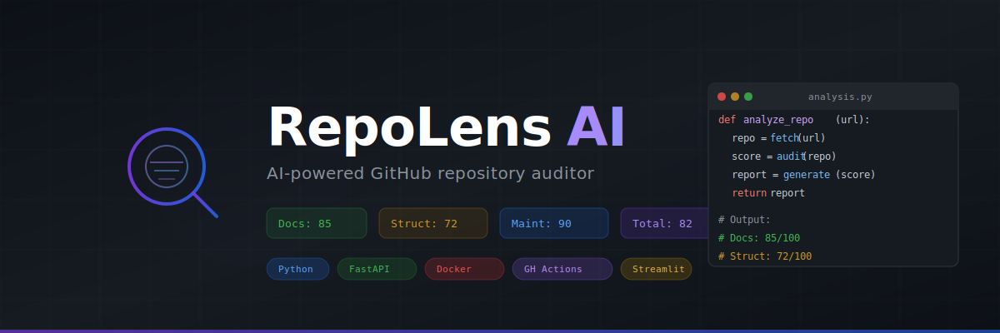

# RepoLens AI

<p align="center">
  
</p>

<p align="center">
  <strong>AI-powered GitHub repository auditor that turns any public repo into a quality report, roadmap, and improvement plan.</strong>
</p>

<p align="center">
  
  
  
  
  
  
</p>

---

## What It Does

Paste any public GitHub URL → get instant analysis:

- **📊 Multi-Dimensional Scoring** — Documentation, Structure, Maintainability, Product-Readiness, Overall
- **🏗️ Tech Stack Detection** — 30+ frameworks auto-detected (React, Next.js, Django, FastAPI, etc.)
- **📝 README Quality Analysis** — 12-point weighted checklist
- **🔒 Security & Config Audit** — Checks for .env templates, .gitignore, security policies
- **🤖 AI Maintainer Report** — GPT-powered analysis with strengths, weaknesses, and recommendations
- **📋 Suggested GitHub Issues** — Auto-generated issues with labels
- **🗺️ 7-Day Roadmap** — Day-by-day improvement plan
- **📥 Export** — Download as Markdown or JSON

---

## Quick Start

```bash
# Clone
git clone https://github.com/garaptross1-blip/repolens-ai.git
cd repolens-ai

# Setup
python -m venv venv
source venv/bin/activate
pip install -r requirements.txt

# Configure
cp .env.example .env
# Add your OpenAI API key to .env

# Run
streamlit run app.py
```

Open [http://localhost:8501](http://localhost:8501)

---

## How It Works

```
┌─────────────────────────────────────────────────────────────────┐
│                         User Input                               │
│                    GitHub Repository URL                          │
└──────────────────────────┬──────────────────────────────────────┘
                           │
         ┌─────────────────┼─────────────────┐
         ▼                 ▼                 ▼
   ┌──────────┐    ┌──────────────┐    ┌──────────┐
   │  GitHub   │    │   GitHub     │    │  Branch  │
   │  Raw URL  │    │   API        │    │ Detection│
   │  Fetcher  │    │  (metadata)  │    │          │
   └─────┬────┘    └──────┬───────┘    └────┬─────┘
         │                │                  │
         └────────────────┼──────────────────┘
                          ▼
              ┌───────────────────────┐
              │    Analysis Pipeline   │
              │                        │
              │  • Tech Stack Detect   │
              │  • README Quality      │
              │  • Structure Scoring   │
              │  • Security Checklist  │
              └───────────┬───────────┘
                          │
              ┌───────────▼───────────┐
              │    AI Engine (GPT)     │
              │                        │
              │  • Project Summary     │
              │  • Strengths/Weaknesses│
              │  • Suggested Issues    │
              │  • 7-Day Roadmap       │
              └───────────┬───────────┘
                          │
              ┌───────────▼───────────┐
              │    Report Builder      │
              │                        │
              │  • Markdown Report     │
              │  • JSON Export         │
              │  • Score Dashboard     │
              └───────────────────────┘
```

---

## Scoring System

| Dimension | What It Measures |
|-----------|-----------------|
| **Documentation** | README quality (title, description, install, usage, features, etc.) |
| **Structure** | File organization (LICENSE, .gitignore, deps, Dockerfile, CI, etc.) |
| **Maintainability** | CI/CD, Docker, changelog, security policy, contributing guide |
| **Product-Readiness** | License, dependencies, Docker, env template, stack detection |
| **Overall** | Weighted average of all dimensions |

**Grades:** A+ (90+) → A (80+) → B (70+) → C (60+) → D (50+) → F (<50)

---

## Tech Stack

| Component | Technology |
|-----------|-----------|
| Frontend | Streamlit (dark theme) |
| Backend | Python 3.10+ |
| AI Engine | OpenAI GPT-4o-mini |
| Data | GitHub Raw URLs + GitHub API |
| Export | Markdown + JSON |

---

## Project Structure

```
repolens-ai/
├── app.py                    # Streamlit dashboard (345 lines)
├── src/
│   ├── github_fetcher.py     # GitHub file fetching & URL parsing
│   ├── analyzer.py           # Tech stack, README, structure analysis
│   ├── scoring.py            # Composite scoring engine
│   ├── ai_engine.py          # LLM-powered analysis (OpenAI/Groq)
│   └── report_builder.py     # Markdown report assembly
├── .streamlit/config.toml    # Dark theme config
├── .github/workflows/ci.yml  # GitHub Actions CI
├── assets/banner.svg          # Project banner
├── docs/                      # Architecture & workflow docs
├── examples/                  # Sample report output
├── requirements.txt
├── .env.example
├── CONTRIBUTING.md
├── LICENSE (MIT)
└── README.md
```

---

## Roadmap

- [x] GitHub raw file fetching with branch detection
- [x] Tech stack detection (30+ frameworks)
- [x] README quality analysis (12-point checklist)
- [x] Multi-dimensional scoring system
- [x] AI-powered analysis via OpenAI
- [x] Dark theme Streamlit UI
- [x] Markdown & JSON export
- [x] GitHub Actions CI
- [ ] GitHub API integration (auto-create issues)
- [ ] Batch repository comparison
- [ ] Local LLM support (Ollama)
- [ ] Streamlit Cloud deployment
- [ ] Custom scoring weights
- [ ] REST API endpoint

---

## Contributing

Contributions welcome! See [CONTRIBUTING.md](CONTRIBUTING.md).

```bash
git clone https://github.com/garaptross1-blip/repolens-ai.git
cd repolens-ai
git checkout -b feature/your-feature
# Make changes
# Submit PR
```

---

## License

MIT — see [LICENSE](LICENSE)

---

<p align="center">
  <b>Built with 🧠 by developers, for developers</b><br>
  <a href="https://github.com/garaptross1-blip/repolens-ai/issues">Report Bug</a> ·
  <a href="https://github.com/garaptross1-blip/repolens-ai/issues">Request Feature</a> ·
  <a href="https://github.com/garaptross1-blip/repolens-ai">⭐ Star</a>
</p>
